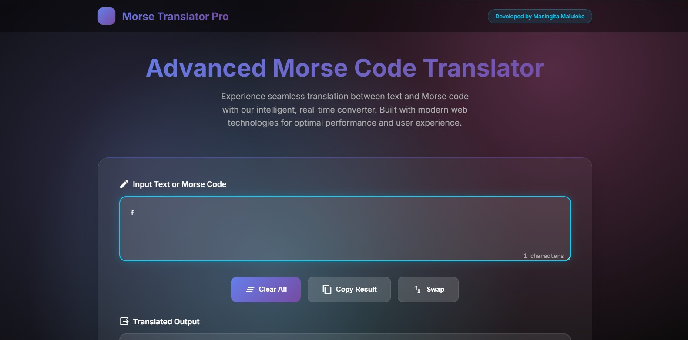
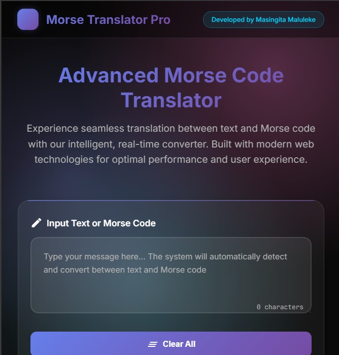

# Morse Code Translator Pro

<div align="center">
  
  
  [](https://tinyu01.github.io/Morse-Code-Translator/src/)
  [](https://github.com/Tinyu01/Morse-Code-Translator/stargazers)
  [](LICENSE)
  [](https://developer.mozilla.org/en-US/docs/Web/JavaScript)
</div>

---

## 📖 Overview

A modern, responsive web application for real-time Morse code translation, built with vanilla HTML, CSS, and JavaScript. Features a stunning glassmorphism UI design, instant encoding/decoding capabilities, and seamless cross-device compatibility.

**🔗 [Live Demo](https://tinyu01.github.io/Morse-Code-Translator/src/)** | **📱 [Mobile Preview](src/assets/images/Screenshot2.jpg)**

---

## ✨ Key Features

### 🚀 Core Functionality
- **Real-time Translation**: Instant bidirectional conversion between text and Morse code
- **Smart Detection**: Automatically identifies input type (text or Morse code)
- **Privacy-First**: 100% client-side processing - your data never leaves your device
- **Cross-Platform**: Works seamlessly on desktop, tablet, and mobile devices

### 🎨 User Experience
- **Modern UI**: Sleek glassmorphism design with smooth animations
- **Interactive Controls**: Clear, copy, and swap buttons for enhanced workflow
- **Character Counters**: Real-time input/output length tracking
- **Responsive Design**: Optimized layouts for all screen sizes

### ♿ Accessibility (Work in Progress)
- ARIA-compliant components for screen readers
- Keyboard navigation support
- High contrast mode compatibility

---

## 🖼️ Screenshots

<div align="center">
  
  <p><em>Desktop Interface</em></p>
  
  
  <p><em>Mobile Interface</em></p>
</div>

---

## 🚀 Quick Start

### Prerequisites
- Modern web browser (Chrome 90+, Firefox 88+, Safari 14+, Edge 90+)
- Node.js v20.0+ (for development only)

### 🔧 Installation

1. **Clone the repository**
   ```bash
   git clone https://github.com/Tinyu01/Morse-Code-Translator.git
   cd Morse-Code-Translator
   ```

2. **Install dependencies** (for development)
   ```bash
   npm install
   ```

3. **Start development server**
   ```bash
   npm start
   # Opens http://localhost:3000
   ```

4. **Or simply open `index.html`** in your browser for quick testing

---

## 🎯 Usage Guide

### Basic Translation
1. **Open the application** in your web browser
2. **Type text** in the input area to convert to Morse code
3. **Enter Morse code** (dots and dashes) to convert to text
4. **View results** instantly in the output area

### Advanced Features
- **Clear**: Reset both input and output areas
- **Copy**: Copy translated text to clipboard
- **Swap**: Exchange input and output content
- **Character Count**: Monitor input/output length in real-time

### Morse Code Reference
- **Dot**: `.` (short signal)
- **Dash**: `-` (long signal)  
- **Letter separation**: Space
- **Word separation**: Multiple spaces

---

## 🏗️ Development

### Project Structure
```
Morse-Code-Translator/
├── src/
│   ├── assets/
│   │   ├── css/
│   │   │   └── styles.css       # Main stylesheet
│   │   ├── js/
│   │   │   ├── app.js           # Main application logic
│   │   │   └── morse.js         # Morse code library
│   │   └── images/              # Assets and screenshots
│   └── index.html               # Main HTML file
├── tests/
│   ├── unit/                    # Unit tests
│   └── e2e/                     # End-to-end tests
├── docs/
│   ├── CODEBASE.md             # Code documentation
│   ├── CONTRIBUTING.md          # Contribution guidelines
│   └── CHANGELOG.md             # Version history
├── package.json
└── README.md
```

### Available Scripts

```bash
# Development
npm start          # Start development server
npm run dev        # Alternative dev command

# Testing
npm test           # Run all tests
npm run test:unit  # Run unit tests only
npm run test:e2e   # Run end-to-end tests

# Code Quality
npm run lint       # Run ESLint
npm run format     # Format code with Prettier

# Build
npm run build      # Create production build
```

### Technology Stack
- **Frontend**: HTML5, CSS3, Vanilla JavaScript
- **Styling**: CSS Grid, Flexbox, CSS Custom Properties
- **Testing**: Jest, Cypress
- **Development**: Node.js, npm

---

## 🧪 Testing

### Running Tests
```bash
# All tests
npm test

# Unit tests only
npm run test:unit

# End-to-end tests
npm run test:e2e

# Watch mode
npm run test:watch
```

### Coverage Report
```bash
npm run test:coverage
# Opens coverage report in browser
```

---

## 📚 Documentation

- **[Codebase Overview](docs/CODEBASE.md)** - Detailed code architecture
- **[Contributing Guidelines](docs/CONTRIBUTING.md)** - How to contribute
- **[Changelog](docs/CHANGELOG.md)** - Version history and updates
- **[API Documentation](docs/API.md)** - JavaScript API reference

---

## 🤝 Contributing

We welcome contributions! Please see our [Contributing Guidelines](docs/CONTRIBUTING.md) for details.

### Quick Contribution Steps
1. Fork the repository
2. Create a feature branch (`git checkout -b feature/amazing-feature`)
3. Commit changes (`git commit -m 'Add amazing feature'`)
4. Push to branch (`git push origin feature/amazing-feature`)
5. Open a Pull Request

### Development Guidelines
- Follow the existing code style
- Add tests for new features
- Update documentation as needed
- Ensure all tests pass before submitting

---

## 🐛 Bug Reports & Feature Requests

Found a bug or have a feature idea? We'd love to hear from you!

- **Bug Reports**: [Create an Issue](https://github.com/Tinyu01/Morse-Code-Translator/issues/new?template=bug_report.md)
- **Feature Requests**: [Request a Feature](https://github.com/afzafri/Morse-Code-Translator/issues/new?template=feature_request.md)
- **Questions**: [Start a Discussion](https://github.com/Tinyu01/Morse-Code-Translator/discussions)

---

## 📄 License

This project is licensed under the **MIT License** - see the [LICENSE](LICENSE) file for details.

```
MIT License © 2025 Masingita Maluleke
```

---

## 👨‍💻 Author

**Masingita Maluleke**

- 📧 Email: [ortizmal201@gmail.com](mailto:ortizmal201@gmail.com)
- 💼 LinkedIn: [thefreelancer201](https://linkedin.com/in/thefreelancer201)
- 🐙 GitHub: [Tinyu01](https://github.com/Tinyu01)
- 🌐 Portfolio: [Portfolio.com](https://tinyu01.github.io/citi_portfolio_website/)

---

## 🙏 Acknowledgments

- Morse code reference from [International Morse Code](https://en.wikipedia.org/wiki/Morse_code)
- UI inspiration from modern glassmorphism design trends
- Icons provided by [Lucide Icons](https://lucide.dev)
- Testing utilities from [Jest](https://jestjs.io) and [Cypress](https://cypress.io)

---

## ⭐ Support

If you found this project helpful, please consider:
- ⭐ **Starring** the repository
- 🍴 **Forking** for your own projects
- 📢 **Sharing** with others who might find it useful
- 💖 **Sponsoring** the development

---
